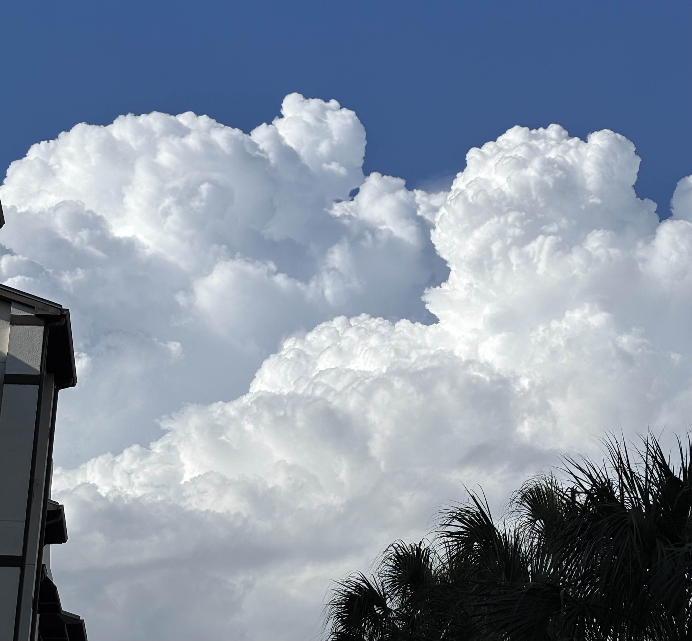

Imagine the light that passes through this cloud.

Light is interesting, we imagine it as both a particle and a wave and yet in computer graphics we always seem to assume light is a particle, flying towards our camera in the time it takes to render a single frame. Light, like other parts of nature, however, act in opposition to us, its *much* faster and *much* more confusing than the simplifications will describe it. Light is much more interesting than these simplifications will lead you to believe, I hope someday we can understand its' beauty, in the meantime we will estimate its' beauty with **Raymarching**. 

Raymarching is a technique that assumes, even further, how light acts. Instead of computing every ray that comes from some light source, we send rays outward (for every pixel) and find which rays will somehow interact with the initial light source. This gives us an estimation, and yet still take a substantial amount of computing power.

I wonder why we haven't found a way to simulate the wave-like properties of light. I'd have to think it's because even simulating waves, like those in an ocean, still require a lot of computing power so its still not as simple as using rays.
# Black Holes

<iframe width="560" height="315" src="https://www.youtube.com/embed/dMohMW29gSM?si=r0G8tohUHJ92waS6" title="YouTube video player" frameborder="0" allow="accelerometer; autoplay; clipboard-write; encrypted-media; gyroscope; picture-in-picture; web-share" referrerpolicy="strict-origin-when-cross-origin" allowfullscreen></iframe>

I saw this incredible video attempting to simulate a black hole by *assuming* light acts as an object with mass and will be pulled in by a black hole. In reality black holes warp space and time such that light moving in a "straight" path appears to curve. It's still something I very much don't understand but for now this assumption will do.

To obtain a curve or "gravitational pull" on this ray that passes by the black hole, we must first find the distance to the black hole. Since we're already using ray's it'll be easiest to use **Signed Distance Functions**. These are like building blocks of building geometry out of rays instead of the typical triangles we're used to. We traverse along the ray, calculating the distance from some SDF shape, and once we "enter" the shape (where the distance is less than zero) we stop the ray and set the color value to the color of the shape. However, we'll be using the typical SDF's a little differently. Instead, we'll be using the distance to apply the gravitational pull the ray experiences.
# Implementing in Godot
Implementation of raymarching requires (typically) making a post-processing shader that will take the current screen texture as input, and output its modification.
## Typical Shaders in Godot
Godot has its own shader language aptly named GDShader's. Shaders have a few different types that make it easier to work in for specific scenarios, the ones important to us are [CanvasItem](https://docs.godotengine.org/en/stable/tutorials/shaders/shader_reference/canvas_item_shader.html) and Spatial shaders. CanvasItem shaders are are those made for UI and 2D games, Spatial shaders are made for 3D objects. 

CanvasItem shaders provide the benefit of already acting as a screen that will exist atop our screen to modify the current screen texture. 
## Clouds 

# References
- Based on this [video](https://www.youtube.com/watch?v=dMohMW29gSM)
- Oh and [this one](https://www.youtube.com/watch?v=ryB8hT5TMSg) too
- [SDF's](https://iquilezles.org/articles/distfunctions/)
- [Godot Shaders Documentation](https://docs.godotengine.org/en/stable/tutorials/shaders/index.html)
# Further Reading
- [4D Raytracing](https://www.youtube.com/watch?v=FS8NotZ3diY)
- [GitHub Source Code](https://github.com/MW-0317/Godot-Raymarching)
# Future Ideas
- [Dithering](https://www.youtube.com/watch?v=8wOUe32Pt-E) to recreate how the first rendered black hole looks
- FFT to recreate [lens effects](https://www.youtube.com/watch?v=QWqb5Gewbx8)
- Weather Simulation of some sort
- [Particle Simulation](https://www.reddit.com/r/creativecoding/comments/1n7hu40/black_hole_simulation_using_300000_particles/)
- Phase change of [clouds and rain](https://www.youtube.com/watch?v=itRV2jEtV8Q)
